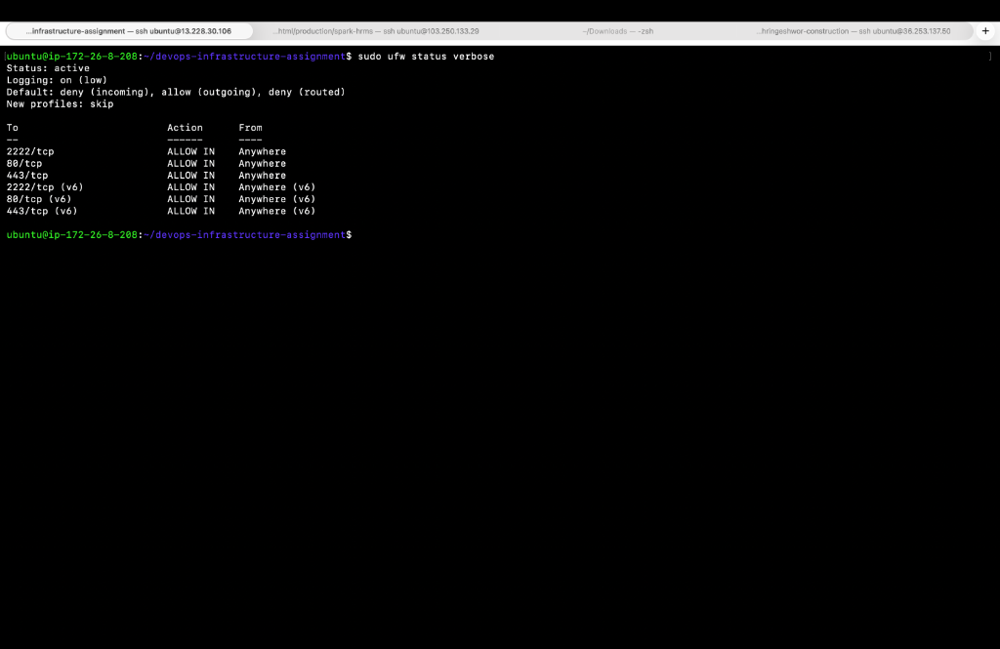
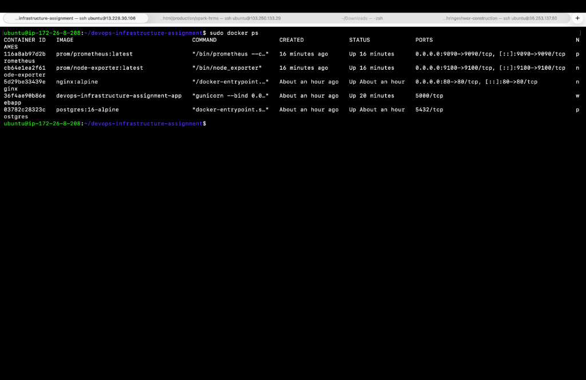
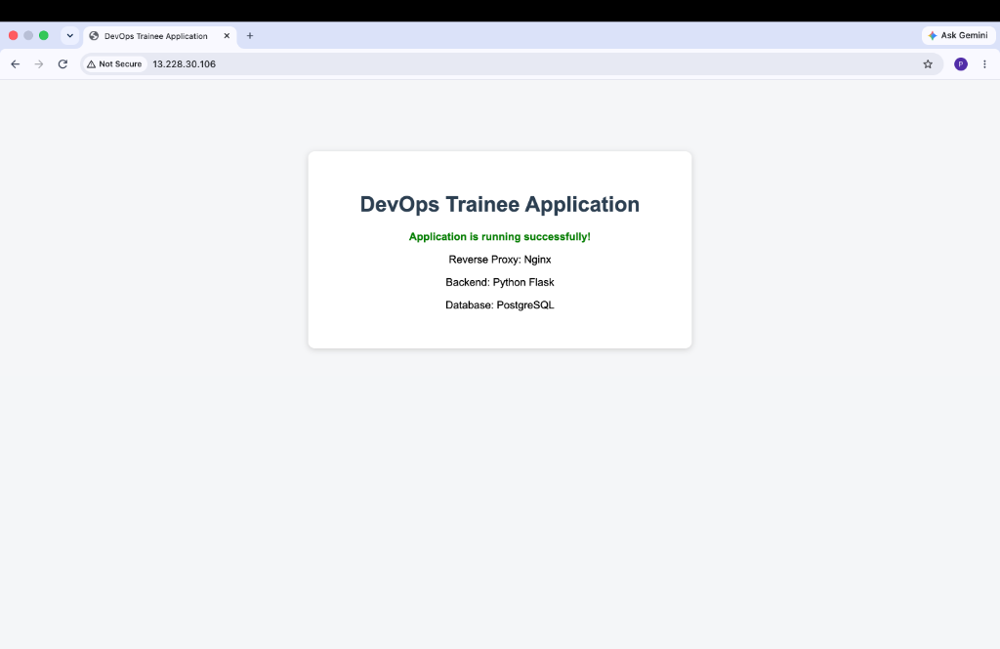
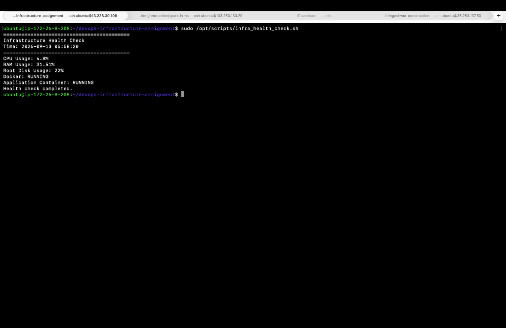

# IT Infrastructure & DevOps Trainee Assignment

## 1. Project Overview

This project implements a small containerized web infrastructure on Ubuntu.

### Technologies

* Ubuntu Linux
* OpenSSH
* UFW
* Docker
* Docker Compose
* Nginx
* Python Flask
* PostgreSQL
* Bash
* Cron
* Prometheus
* Node Exporter
* Git

## 2. Architecture

```text
                    Client
                      |
                      | HTTP :80
                      v
               +--------------+
               |    Nginx     |
               | Reverse Proxy|
               +------+-------+
                      |
                      | :5000
                      v
               +--------------+
               | Flask Web App|
               +------+-------+
                      |
                      | :5432
                      v
               +--------------+
               | PostgreSQL   |
               | Persistent DB|
               +--------------+
```

## 3. Linux Configuration

### Dedicated User

A user named `trainee` was created with sudo privileges.

Verification:

```bash
id trainee
groups trainee
sudo -l -U trainee
```

### SSH Configuration

SSH was configured to:

* Listen on port `2222`
* Disable direct root login
* Disable password authentication
* Enable public-key authentication

Verification:

```bash
sudo sshd -t
sudo grep -E '^(Port|PermitRootLogin|PasswordAuthentication|PubkeyAuthentication)' /etc/ssh/sshd_config
```

SSH connection:

```bash
ssh -p 2222 trainee@SERVER_IP
```

## 4. Firewall

UFW allows only:

* TCP 2222 - SSH
* TCP 80 - HTTP
* TCP 443 - HTTPS

Verification:

```bash
sudo ufw status verbose
```

### Screenshot



## 5. Docker Deployment

Build and start the stack:

```bash
docker compose up -d --build
```

Check containers:

```bash
docker ps
```

Expected services:

* nginx
* webapp
* postgres

### Screenshot



## 6. Reverse Proxy Verification

Test the application:

```bash
curl http://localhost/
```

Health endpoint:

```bash
curl http://localhost/health
```

Expected:

```json
{
  "status": "healthy"
}
```

Database health:

```bash
curl http://localhost/db-health
```

Expected:

```json
{
  "database": "connected"
}
```

The application can also be accessed from a browser:

```text
http://SERVER_IP/
```

### Screenshot



## 7. Health Check Script

The health-check script is located at:

```text
/opt/scripts/infra_health_check.sh
```

It checks:

* CPU utilization
* RAM utilization
* Root filesystem utilization
* Docker service status
* Web application container status

Run manually:

```bash
sudo /opt/scripts/infra_health_check.sh
```

The disk warning threshold is 85%.

The application container is considered unhealthy when the `webapp` container is stopped.

Warnings are written to:

```text
/var/log/infra_health.log
```

View the log:

```bash
sudo cat /var/log/infra_health.log
```

### Cron

The script runs every 15 minutes.

```bash
sudo crontab -l
```

Expected:

```text
*/15 * * * * /opt/scripts/infra_health_check.sh
```

### Screenshot



## 8. Database Backup

Backup script:

```text
/opt/scripts/db_backup.sh
```

Run:

```bash
sudo /opt/scripts/db_backup.sh
```

Backups are stored in:

```text
/var/backups/db/
```

Example:

```text
db_backup_20260913.sql.gz
```

List backups:

```bash
ls -lh /var/backups/db/
```

## 9. Database Restoration

To restore a backup:

```bash
gunzip -c /var/backups/db/db_backup_YYYYMMDD.sql.gz | \
docker exec -i postgres psql \
-U appuser \
-d appdb
```

## 10. Monitoring

Prometheus and Node Exporter are used for basic system metric collection.

Prometheus collects metrics from Node Exporter every 15 seconds.

Prometheus can be accessed securely through an SSH tunnel:

```bash
ssh -L 9090:localhost:9090 -p 2222 trainee@SERVER_IP
```

Then open:

```text
http://localhost:9090
```

Port 9090 is intentionally not opened in UFW because the assignment requires only ports 2222, 80 and 443 to be allowed.

## 11. Teardown

Stop the main application:

```bash
docker compose down
```

Stop monitoring:

```bash
cd monitoring
docker compose -f docker-compose.monitoring.yml down
```

To remove containers and the database volume:

```bash
docker compose down -v
```

**Warning:** Removing the volume deletes PostgreSQL persistent data.

## 12. Useful Verification Commands

### Firewall

```bash
sudo ufw status verbose
```

### SSH

```bash
sudo ss -tlnp | grep 2222
```

### Docker

```bash
docker ps
docker compose ps
```

### Application

```bash
curl http://localhost/
curl http://localhost/health
curl http://localhost/db-health
```

### PostgreSQL

```bash
docker exec postgres pg_isready -U appuser -d appdb
```

### Disk

```bash
df -h /
```

### Memory

```bash
free -h
```

### CPU

```bash
top
```

### Health Check

```bash
sudo /opt/scripts/infra_health_check.sh
```

### Backup

```bash
sudo /opt/scripts/db_backup.sh
ls -lh /var/backups/db/
```

## 13. Git Branches

The project uses feature branches for implementation.

Example branches:

```text
main
feature/docker-setup
feature/scripts
feature/monitoring
```

Branches were merged into `main` after completing each feature.

Example commits:

```text
Initial project structure
Add Docker Compose web stack
Add infrastructure health check and database backup scripts
Add Prometheus and Node Exporter monitoring
Add project documentation
```

## 14. Screenshots

The following screenshots are included:

1. UFW firewall status
2. Running Docker containers
3. Browser output from reverse-proxied application
4. Successful health-check execution
5. Health-check warning/log output
6. Prometheus monitoring dashboard

## 15. Conclusion

The completed environment demonstrates Linux administration, SSH hardening, firewall configuration, Docker containerization, reverse proxy configuration, PostgreSQL persistence, Bash automation, scheduled health checks, database backup and restoration, monitoring, Git branching, and technical documentation.
